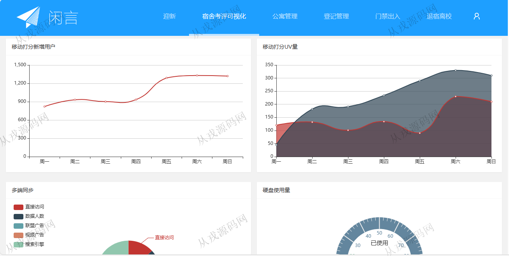
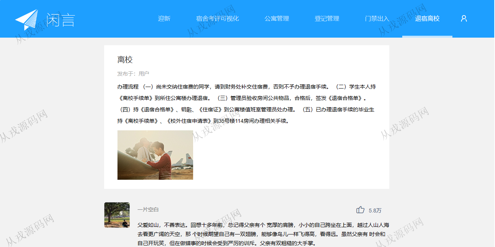
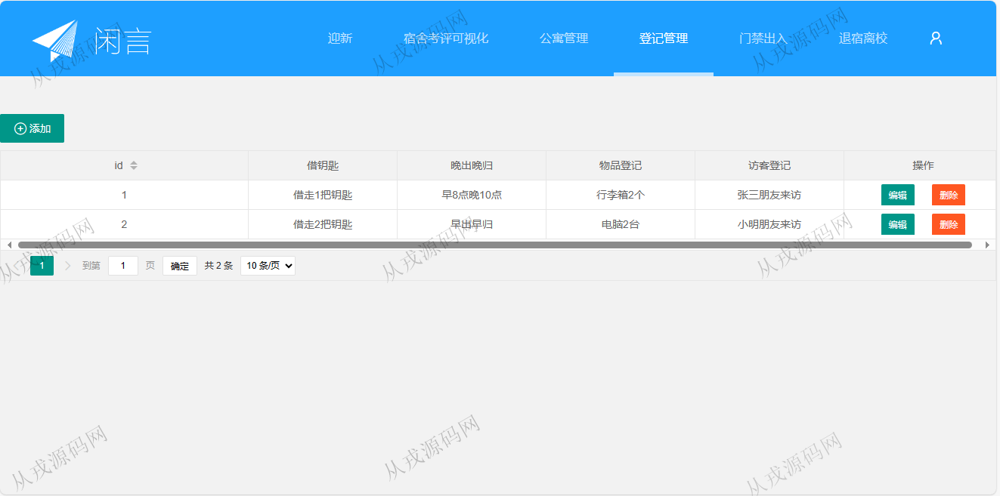
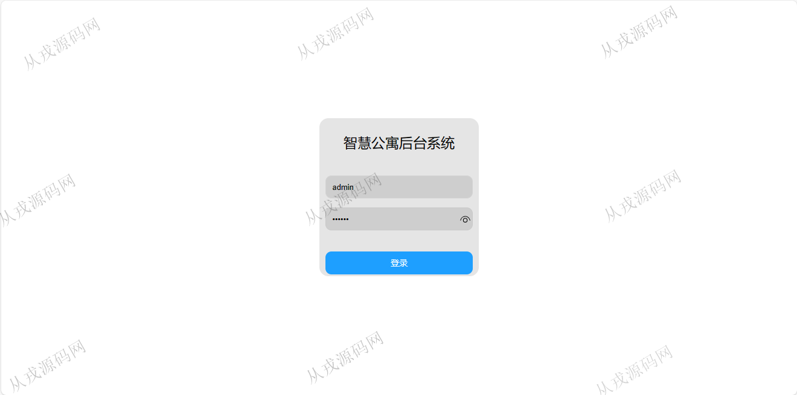
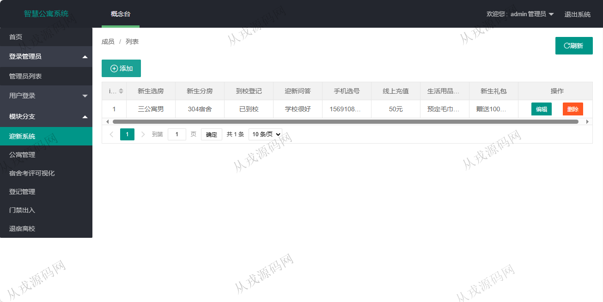
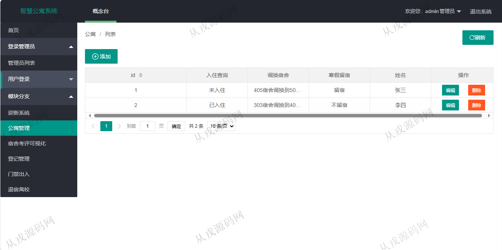
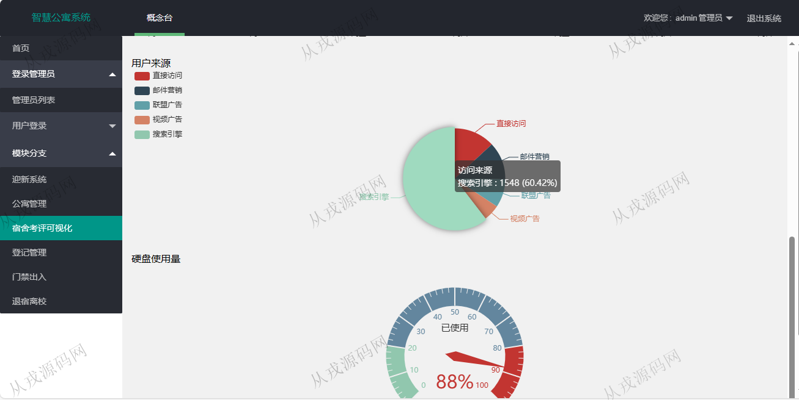
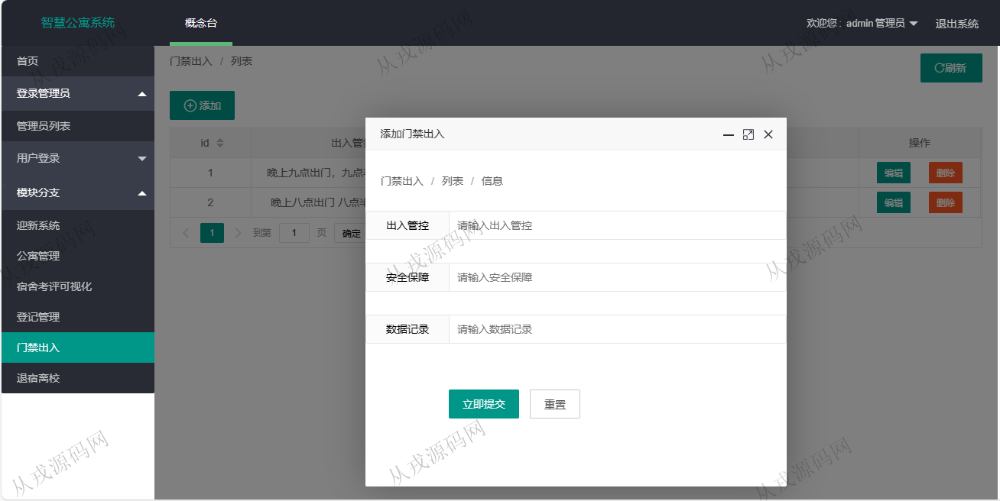
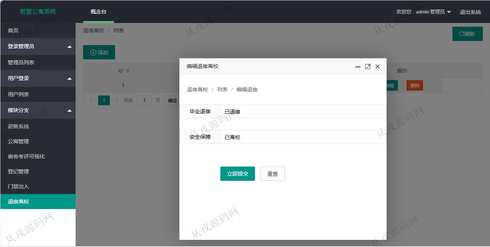

<h1 align="center">168.智慧公寓管理系统</h1>

 获取sql文件 QQ: 386869957 QQ群: 377586148 

 [更多源码项目: 从戎源码网](https://armycodes.com/) 

## 简介

> 本代码来源于网络,仅供学习参考使用!
>
> 提供1.远程部署/2.修改代码/3.设计文档指导/4.框架代码讲解等服务
> 
> 用户端登录地址：http://localhost:19967/family/vivelogin.m
> 
> 用户：user  123456
> 
> 管理后台登录地址：http://localhost:19967/family/login.m
>
> 管理员 : admin 123456

## 项目介绍
基于springboot的智慧公寓管理系统：前端 html、jquery、layui，后端 springmvc、spring、mybatis；角色分为管理员、用户；集成宿舍考评可视化，公寓管理、登记管理等功能于一体的系统。

## 功能介绍

- 迎新：迎新信息的前台展示，后台信息的增删改查，新生礼包
- 公寓管理：公寓信息的增删改查，入住查询，调换宿舍
- 宿舍考评可视化：折线图，饼图图表信息的展示
- 登记管理：登记信息的增删改查，借钥匙，晚出晚归，物品登记，访客登记
- 门禁出入：出入管控，安全保障
- 退宿离校：退宿和离校信息的的增删改查

## 环境

- <b>IntelliJ IDEA 2021.3</b>

- <b>Mysql 5.7.26</b>

- <b>JDK 1.8</b>

## 运行截图

